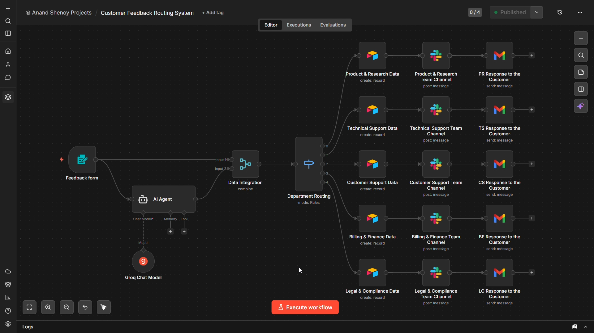

# 📬 Customer Feedback Routing System

An AI Agent-powered agentic workflow built on n8n that automatically classifies incoming customer feedback and routes it to the correct department — notifying the team on Slack, logging the record to Airtable, and sending the customer a personalised acknowledgement email, all without any human triage.

## 📖 Overview

Businesses receiving customer feedback through a single inbox face a constant bottleneck — someone must manually read every message, decide which department it belongs to, forward it, and acknowledge the customer. This process is slow, error-prone, and breaks down entirely as feedback volume grows.

This project eliminates that bottleneck by deploying an AI Agent that reads each submission and classifies it into one of five departments: Product & Research, Technical Support, Customer Support, Billing & Finance, or Legal & Compliance. A Switch node then branches the workflow into five parallel paths — each logging the feedback to Airtable, alerting the team on Slack, and sending a department-specific reply to the customer via Gmail, all within seconds of form submission.

## ✨ Key Features

* **AI-Powered Classification:** The AI Agent node uses `groq/compound` to read the customer's message and return exactly one department name, ensuring clean and reliable downstream routing.
* **n8n Native Form:** A built-in n8n Form Trigger collects the customer's Name, Email, and Message — no external form builder required.
* **5-Way Switch Routing:** A Switch node branches the workflow into five independent paths based on the AI's output, so each submission reaches only the correct team.
* **Airtable Logging:** Each routing path writes the feedback record (Timestamp, Name, Email, Message) into the corresponding department-specific table in Airtable.
* **Slack Notifications:** Each routing path instantly posts the feedback to the relevant department's dedicated Slack channel.
* **Automated Gmail Reply:** Each routing path sends the customer a personalised acknowledgement email referencing their name and the department their feedback was routed to.

## 🛠️ Technologies

* **Workflow Orchestration:** n8n (Community Edition — free, self-hosted)
* **Form & Trigger:** n8n Form Trigger Node
* **LLM Provider:** Groq API (free tier — `groq/compound`)
* **AI Orchestration:** n8n AI Agent Node
* **Routing Logic:** n8n Switch Node
* **Feedback Database:** Airtable (5 department tables inside one base)
* **Team Notifications:** Slack (Bot OAuth — 5 department channels)
* **Customer Communication:** Gmail (OAuth2 — automated acknowledgement emails)

## 🔄 Workflow Architecture

The workflow begins when a customer submits the n8n Form. The AI Agent reads the message and classifies it into one of five departments. A Merge node combines the original form data with the AI's output, and a Switch node branches into five parallel paths. Each path simultaneously writes the record to its Airtable table, posts to its Slack channel, and sends a Gmail reply to the customer.

## 📝 Prerequisites

* An n8n instance — self-hosted via `npm install -g n8n` (Node.js v20+) or n8n Cloud free trial at `app.n8n.cloud`
* A free Groq API key from `console.groq.com` (no credit card required)
* An Airtable account with one base (`Customer Feedback Data`) containing five tables, each with columns: `Timestamp`, `Name`, `Email id`, `Message`
* A Slack workspace with five department channels and a Slack Bot App with `chat:write` scope installed and invited to each channel
* A Gmail account with OAuth2 access granted to n8n

## 🎥 Project Demonstration

Click to watch the demo!

  

